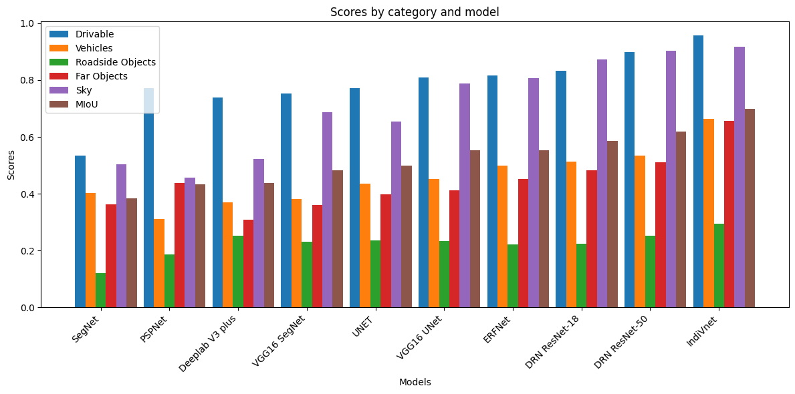

# IndiVnet

## Overview
We propose IndiVnet, a novel segmentation model designed explicitly for Indian driving scenarios. As Autonomous vehicle technology has witnessed significant advancements globally, challenges unique to India's diverse driving conditions remain unaddressed. Existing segmentation models, tailored for Western environments, fall short of capturing the intricacies of Indian roadways characterized by complexity, congestion, and cultural nuances. To fill this gap, we proposed our model. Evaluation against state-of-the-art models showcases IndiVnet's superior performance, with a Mean Intersection over Union (MIoU) of 0.6998. This research underlines the importance of tailored approaches for autonomous navigation in diverse global contexts, emphasizing the need for region-specific datasets and models to ensure safe and efficient autonomous driving experiences.


## Folder Structure
- **data_load_and_preprocessing/**: Contains scripts for loading and preprocessing the dataset.
- **model/**: Includes scripts for defining the machine learning models. 
- **train/**: Contains scripts for training the models.
- **test/**: Includes scripts for testing the models.
- **IndiVnet main/**:Contains code for end-to-end model implementation using all the scripts.


## Result
Across the different models, the performance varies for each semantic class. For instance, in the "roadside object" class, DRN ResNet 18 demonstrated the highest TP value of 1,794, while for the "far object" class, IndiVNet exhibited the highest TP value of 10,420. Moreover, the "sky" class saw VGG16 UNet achieving the highest TP value of 9,889.

| Class             | TP     | FP   | TN      | FN   | F1-Score | Accuracy |  IoU  |  MIoU  |
| ----------------- | ------ | ---- | ------- | ---- | -------- | -------- | ----- | ------ |
| Drivable          | 25008  | 655  | 102077  | 446  | 0.9850   | 0.9914   | 0.958 |        |
| Vehicle           | 2134   | 634  | 3091    | 446  | 0.8192   | 0.8287   | 0.664 |        |
| Roadside Object   | 2052   | 2005 | 3513    | 2911 | 0.5255   | 0.5310   | 0.294 | 0.6998 |
| Far Object        | 10420  | 1949 | 59983   | 3498 | 0.9907   | 0.9282   | 0.657 |        |
| Sky               | 16878  | 213  | 6341    | 1305 | 0.9015   | 0.9386   | 0.917 |        |




## Getting Started

### Prerequisites
Ensure you have the following dependencies installed:
- Python 3.x
- Required libraries (specified in `requirements.txt`)

Install the dependencies using pip:
```bash
pip install -r requirements.txt

## License

This project is licensed under the MIT License - see the [LICENSE](LICENSE.txt) file for details.

